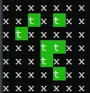

# Java Forest Simulator

## Demo

### How it works

- **Green/t**: Represents for trees.
- **Red/b**: Represents fire.
- **Black/x**: Represents an empty square.

1. If a sqaure is burining it will become empty in the next iteration.
2. If a square is empty it has a chance to become a tree.
3. If a tree touches fire in any 8 neighbouring squares it burns.
4. Any tree can randomly burn, even if it is not touching fire.
